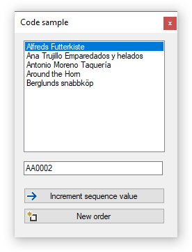

# Increment Alpha Numeric Value C#
This repository shows how to create an Increment Alpha Numeric Value for use like creating account numbers e.g. A001, A002 etc which demonstrated by working with a SQL-Server database, customer account numbers.

[Microsoft TechNet article](https://social.technet.microsoft.com/wiki/contents/articles/53956.auto-incrementing-alphanumeric-invoice-number-c.aspx)

